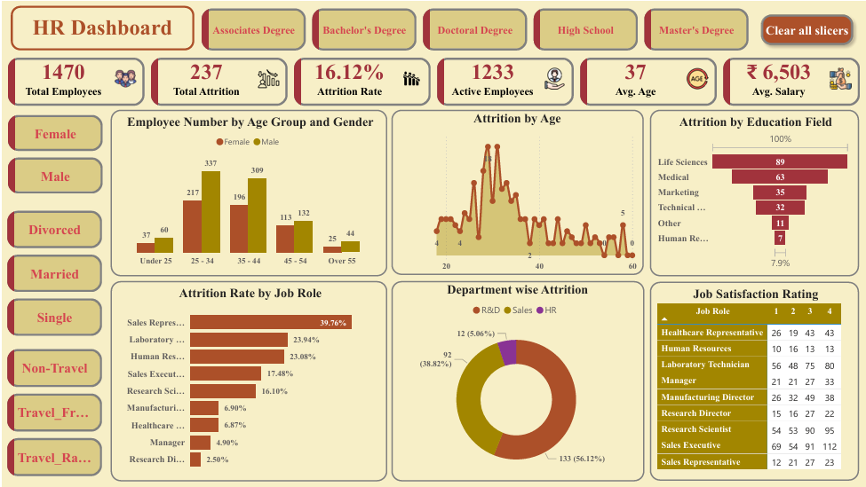

# 👥 HR Analytics & Employee Attrition Dashboard
An interactive Power BI dashboard designed to analyze employee retention trends, department-wise headcount loss, demographic distributions, and satisfaction scores across job roles.
---
## 📊 Dashboard Preview

---
## 🔑 Key Performance Indicators (KPIs)
* **Total Employees:** 1,470
* **Total Attrition:** 237 employees
* **Overall Attrition Rate:** 16.12%
* **Active Workforce:** 1,233 employees
* **Average Workforce Age:** 37 years
* **Average Monthly Salary:** ₹6,503
---
## 📈 Key Insights & Dashboard Visualizations
* **Department Attrition:** Research & Development accounts for the majority of headcount loss (**56.12%** / 133 employees), followed by Sales (**38.82%** / 92 employees) and HR (**5.06%** / 12 employees).
* **Role-Wise Risk:** Sales Representatives experience the highest attrition rate at **39.76%**, followed by Laboratory Technicians (**23.94%**) and HR Representatives (**23.08%**).
* **Education Field:** Employees from Life Sciences (**89**) and Medical backgrounds (**63**) contribute to the highest volume of attrition.
* **Demographics:** Workforce distribution peaks within the 25–34 age bracket across both male and female staff.
* **Job Satisfaction Ratings:** Matrix visual maps rating scales (1 to 4) across key job roles to identify satisfaction gaps.
---
## 🛠️ Tools & Power BI Features Used
* Data Modeling & DAX Measures
* Custom KPI Card Visuals
* Funnel Charts, Donut Charts, Horizontal Bar Charts, and Matrix Tables
* Dynamic Slicers (Education Level, Gender, Marital Status, Business Travel Frequency)
* Custom Canvas Formatting & Navigation Buttons ("Clear all slicers")
---
## 🚀 How to View the Project
1. Download or clone this repository:
   ```bash
   git clone [https://github.com/svvdainsights-gif/hr-analytics-employee-attrition-dashboard.git](https://github.com/svvdainsights-gif/hr-analytics-employee-attrition-dashboard.git)
